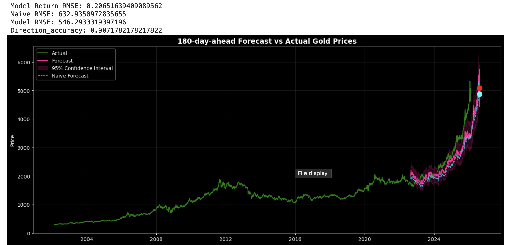
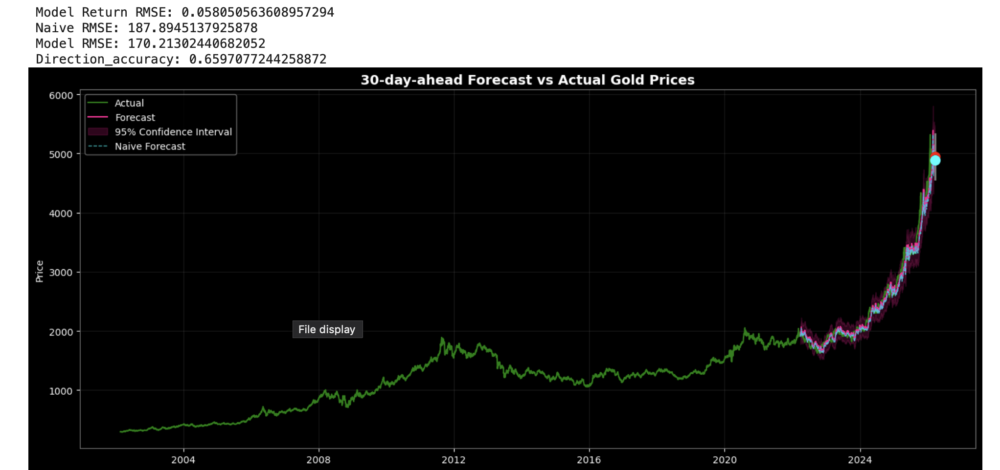

# Gold Price Time-Series Forecasting with XGBoost

``` Built a multi-horizon gold price forecasting model (1, 30, 180 days) using XGBoost with macroeconomic and technical indicators. The 180-day model achieved 90% directional accuracy and significantly outperformed Naive random walk benchmarks by 6.7%. ```

- For view in Github: use ***gold_price_forecast_notebook.ipynb***
- For interactive graph version (required local download): use gold_price_forecast_notebook_(plotlyver).ipynb

> ## Overview

This project forecasts gold prices using:

- XGBoost with extensive feature engineering
- Prophet model (baseline comparison)
- Naive model (baseline comparison)
- Multi-horizon forecasting (1, 30, 180 days)

Data Source:
- Yahoo Finance API
- FRED API

---

> ## Exploratory Analysis

- STL decomposition performed
- Weak to medium annual seasonality detected

---

> ## Feature Engineering

### Technical Features
- Lag features (1–365 days)
- Moving averages (SMA, EMA)
- Momentum indicators
- Volatility (rolling std)
- RSI
- MACD
- Trend spreads (MA crossovers)

### Macroeconomic Features
- S&P 500
- Dollar Index (DXY)
- VIX
- CPI
- 10-Year Treasury Yield

---

> ## Modeling Approach

Forecast return first, then convert to price:

\[
Price_{t+h} = Price_t \times (1 + Predicted\ Return)
\]

Models built for:
- 1-day ahead
- 30-day ahead
- 180-day ahead

Compared against:
- Naive random walk
- Prophet model

---

> ## Results

### 180-Day Model
- Return RMSE: **0.2065**
- Price RMSE: **546.29**
- Naive RMSE: 632.94
- Directional Accuracy: **90.7%**

### 30-Day Model
- Return RMSE: **0.0580**
- Price RMSE: **170.21**
- Naive RMSE: 187.89
- Directional Accuracy: 65.9%

### 1-Day Model
- Return RMSE: **0.0115**
- Price RMSE: 39.10
- Naive RMSE: 39.17
- Directional Accuracy: 43.8%

### Prophet Model
- RMSE: 684.43
- Failed to capture recent structural surge




---

> ## Key Findings

- XGBoost significantly outperformed naive model for medium and long horizons
- 180-day forecast shows strongest signal
- Gold exhibits strong "random walk with drift" characteristics, making it hard to forecast in short-term
- Model tends to predict constant small positive return
- The 180-day XGBoost model reduced prediction error by 6.7% relative to a naive random walk benchmark, indicating economically meaningful signal extraction

---
